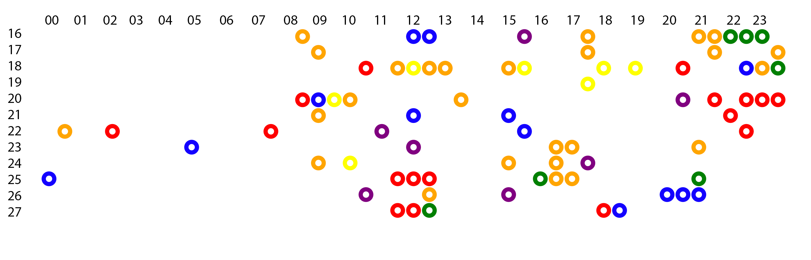

# Data Vis: Project 1 Self Quantification Final

Name: Eunice Yuehan Dai

Subject: The time spent on the messages

Methods: In this assignment I collected the time I used on chatting on the social media during Sep 16th to 27th. I collected the time used for replying the messages and the calling. One circle means half an hour in the reality, and if it is less than half an hour, it will wrap up unless the time is minimum. 

 

 * Red: Family
 * Orange: Selena
 * Yellow: Yama
 * Green: Sangyu
 * Blue: Luna
 * Violet: Others
```
<!DOCTYPE html>
<html lang="en">
	<head>
		<meta charset="utf-8">
		<title>Project 1</title>
		<script type="text/javascript" src="../d3.js"></script>
		<style type="text/css">
			/* No style rules here yet */		
		</style>
	</head>
	<body>
		<div id="canvas"></div>

		<script type="text/javascript">
			// read the data
			d3.csv("data_object.csv")
				.then(function(data) {drawImage(data);})


		// draw the graph
		function drawImage(data) {

			// length of the data is 48, indicating one element means half an hour
			console.log(data);


			var cx = 0;
			var cy = 0;
			
			var svg = d3.select("#canvas")
						.append("svg")
						.attr("width", 750)
						.attr("height", 250);
					
			svg.append("svg:rect")
				.attr("x",0)
				.attr("y",0)
				.attr("width",750)
				.attr("height",250)
				.style("fill", "white");
									

			svg.selectAll("circle")
						.data(data).enter()
						.append("circle")
						.attr("cx", function (d) {
							return d.time * 30;
							
							})
						.attr("cy", function (d) {
							return (d.day - 14) * 15;
							})
						.attr("r", 5)
						.attr("stroke", function (d){
							if (d.type == 1) {
								return "red"
							} else if (d.type == 2) {
								return "orange"
							} else if (d.type == 3) {
								return "yellow"
							} else if (d.type == 4) {
								return "green"
							} else if (d.type == 5) {
								return "blue"
							} else {
								return "purple"
							}
						})
						.attr("stroke-width", 4)
						.attr("fill", "white")
			

		}		
		</script>
	</body>
</html>
```